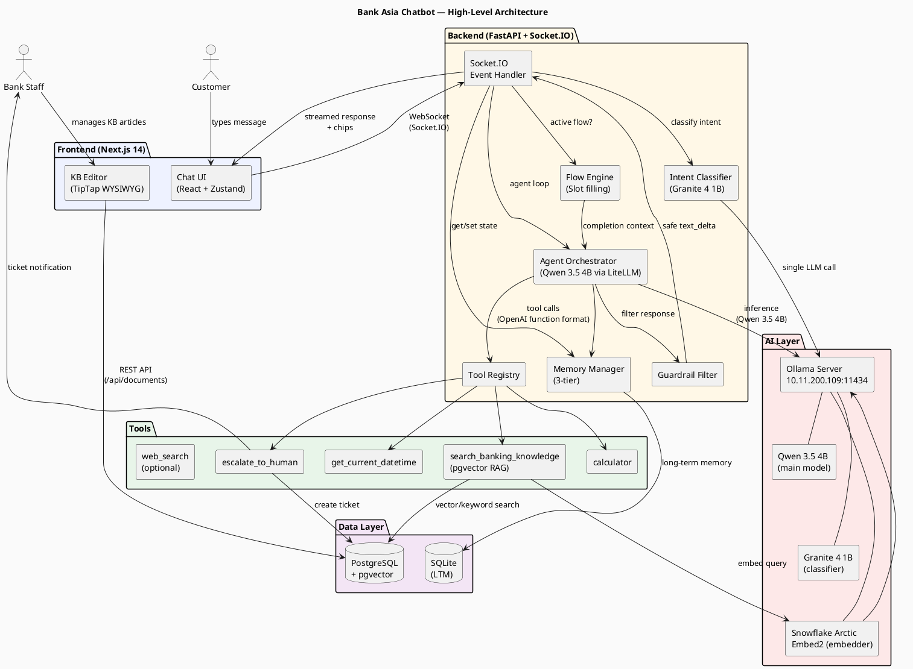
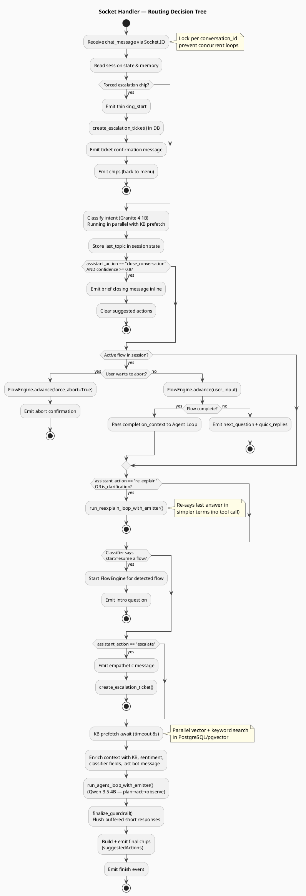
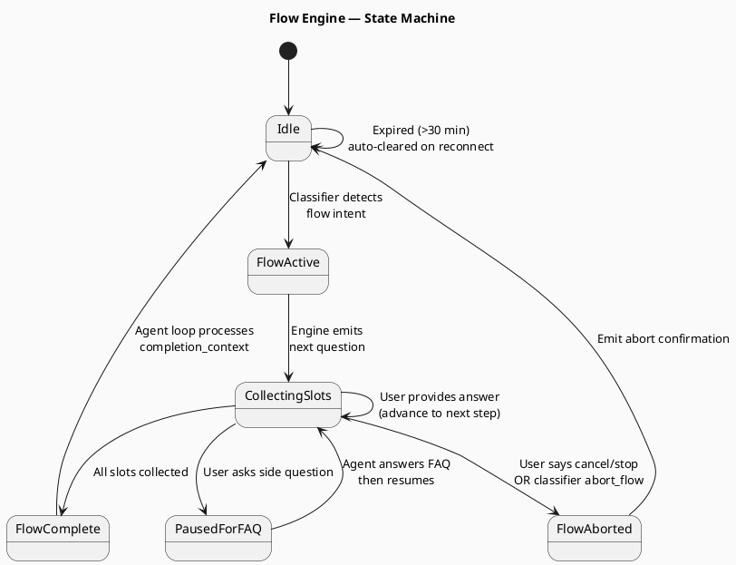
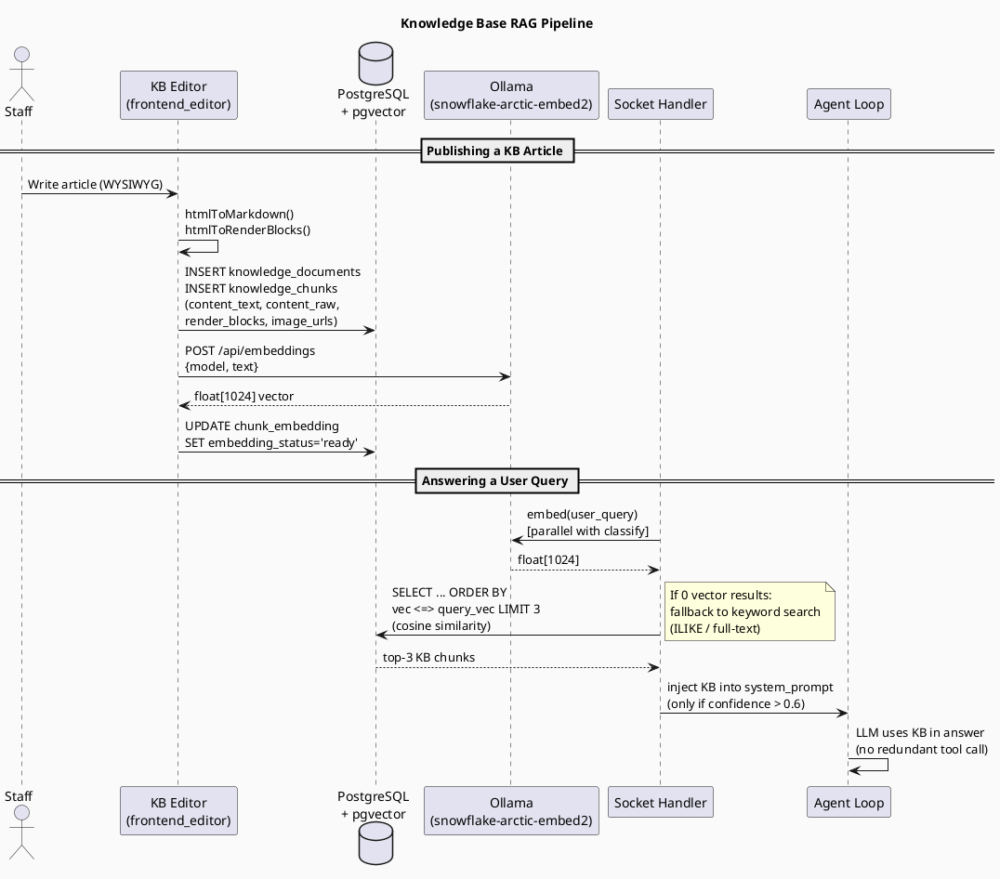
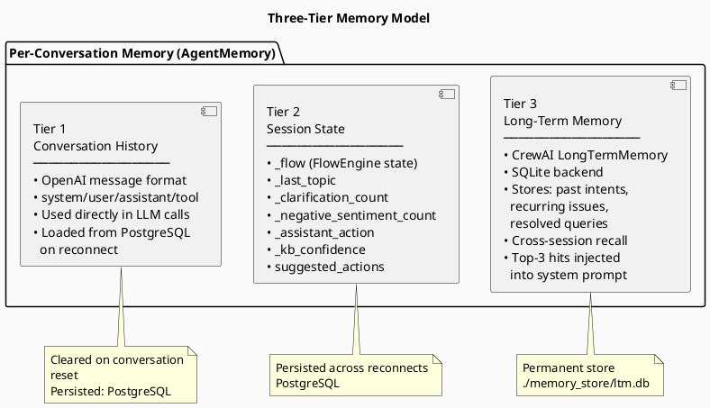
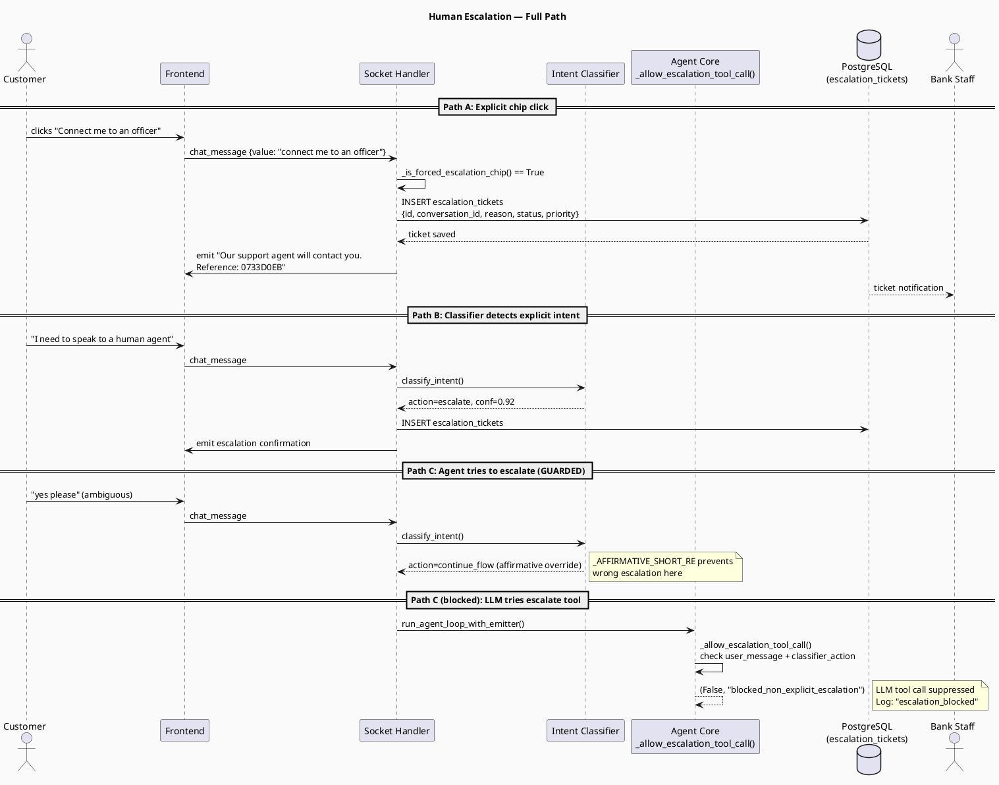
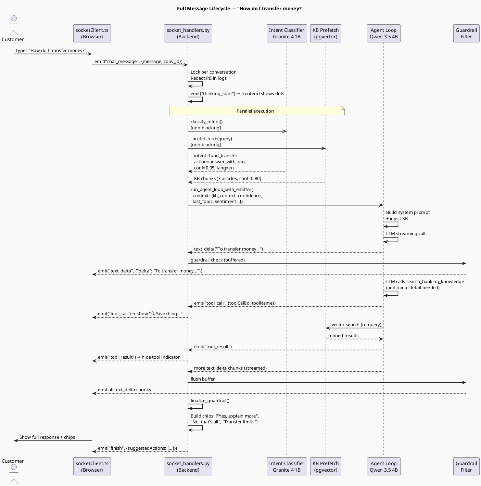
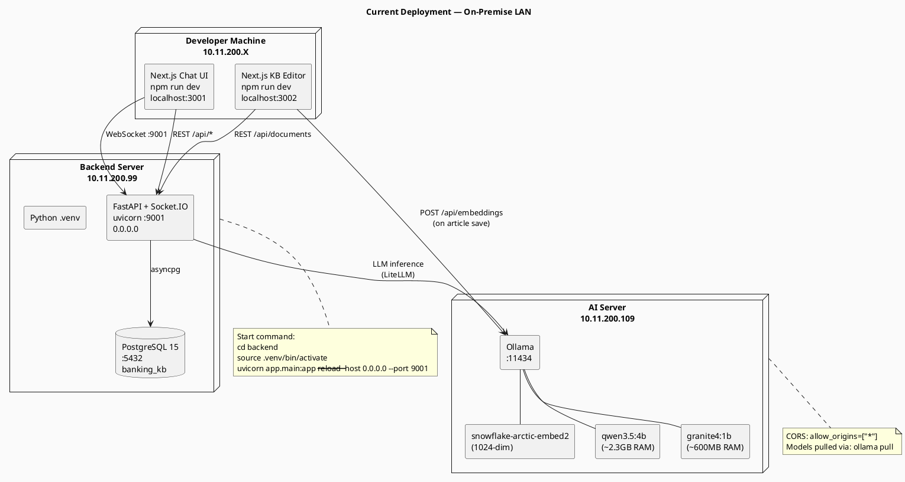

# Bank Asia Help & Support Chatbot — Architecture & Technical Documentation

> **Audience**: Product managers, engineering interns, senior engineers, and management.
> **Version**: 2.0  |  **Date**: April 2026

---

## Table of Contents

1. [Executive Summary](#1-executive-summary)
2. [System Overview](#2-system-overview)
3. [High-Level Architecture Diagram (PlantUML)](#3-high-level-architecture-diagram)
4. [Component-by-Component Breakdown](#4-component-by-component-breakdown)
5. [How Classification Works (Step-by-Step)](#5-how-classification-works)
6. [How Orchestration Works (Agent Loop)](#6-how-orchestration-works)
7. [Routing Decision Tree (PlantUML)](#7-routing-decision-tree)
8. [Flow Engine — Guided Conversations](#8-flow-engine)
9. [Knowledge Base & RAG Pipeline (PlantUML)](#9-rag-pipeline)
10. [Memory Architecture — 3 Tiers](#10-memory-architecture)
11. [Human Escalation Path (PlantUML)](#11-escalation-path)
12. [Tools Reference](#12-tools-reference)
13. [Data Flow — Message Lifecycle (PlantUML)](#13-message-lifecycle)
14. [Security Controls](#14-security-controls)
15. [Scalability & Production Readiness](#15-scalability)
16. [Technology Stack Summary](#16-technology-stack)
17. [Deployment Architecture (PlantUML)](#17-deployment)

---

## 1. Executive Summary

The **Bank Asia Help & Support Chatbot** is a production-grade, AI-powered customer service assistant built to handle banking inquiries across web and mobile interfaces. It delivers intelligent, context-aware responses in **English and Bengali**, guides customers through multi-step processes (e.g., loan applications, transfers), and escalates to human agents when needed.

| Metric | Value |
|--------|-------|
| Primary LLM | Qwen 3.5 4B (self-hosted via Ollama) |
| Classifier LLM | Granite 4 1B (fast, lightweight) |
| Transport | WebSocket (Socket.IO) |
| Knowledge Base | PostgreSQL + pgvector (semantic search) |
| Response latency | ~2–5 seconds end-to-end |
| Languages | English, Bengali, mixed |
| Deployment | On-premise / containerisable |

---

## 2. System Overview

```
┌─────────────────────────────────────────────────────┐
│                  Customer Device                    │
│  Browser / Android WebView (localhost:3001)         │
│  ┌──────────────────────────────────────────────┐  │
│  │  Next.js 14  +  React  +  Zustand  +  TipTap │  │
│  │  (Chat UI)     (State)  (Store)   (KB Editor) │  │
│  └──────────────────────────────────────────────┘  │
└───────────────────────┬─────────────────────────────┘
                        │ WebSocket (Socket.IO)
                        ▼
┌─────────────────────────────────────────────────────┐
│            FastAPI Backend  (port 9001)             │
│  ┌──────────┐  ┌─────────────┐  ┌───────────────┐  │
│  │ Socket.IO│  │ Classifier  │  │  Agent Loop   │  │
│  │ Handler  │→ │   Engine    │→ │  (LiteLLM)    │  │
│  └──────────┘  └─────────────┘  └───────┬───────┘  │
│                                         │           │
│  ┌───────────┐  ┌──────────────────────┐│           │
│  │ FlowEngine│  │     Tool Registry    ││           │
│  └───────────┘  │ vector_search        ││           │
│                 │ escalate_to_human    ││           │
│                 │ calculator           ││           │
│                 │ datetime             │◄           │
│                 │ web_search           │            │
│                 └──────────────────────┘            │
└─────────┬───────────────────────┬───────────────────┘
          │ asyncpg               │ HTTP
          ▼                       ▼
  ┌───────────────┐      ┌─────────────────┐
  │  PostgreSQL   │      │  Ollama Server  │
  │  + pgvector   │      │  (10.11.200.109)|
  │  knowledge_   │      │  qwen3.5:4b     │
  │  chunks       │      │  granite4:1b    │
  │  escalation_  │      │  snowflake-     │
  │  tickets      │      │  arctic-embed2  │
  └───────────────┘      └─────────────────┘
```

---

## 3. High-Level Architecture Diagram



---

## 4. Component-by-Component Breakdown

### 4.1 Frontend — Chat UI (`frontend/`)

| File | Purpose |
|------|---------|
| `src/app/page.tsx` | Root page — mounts `ChatScreen` |
| `src/components/chat/ChatScreen.tsx` | Top-level layout; wires `useChat` hook |
| `src/hooks/useChat.ts` | Socket.IO event registration, message dispatch |
| `src/lib/socketClient.ts` | Singleton Socket.IO client wrapper |
| `src/store/chatStore.ts` | Zustand global state (messages, chips, status) |
| `src/components/chat/messages/` | Per-type renderers: UserMessage, AgentMessage (Markdown), ToolCallMessage, ThinkingIndicator |

**Key behaviour:**
- Connects via WebSocket (falls back to polling) using `?conversation_id=<uuid>` query param.
- Receives streamed `text_delta` events and appends them live — giving token-by-token streaming feel.
- After `finish` event, chips (quick replies) are set from `suggestedActions`.
- `crypto.randomUUID()` is used with a safe fallback for older/non-secure browser contexts.

### 4.2 Frontend — KB Editor (`frontend_editor/`)

| File | Purpose |
|------|---------|
| `src/app/page.tsx` | Full editor page (document list + TipTap editor + live preview) |
| `src/components/EditorPane.tsx` | TipTap WYSIWYG with 10+ extensions |
| `src/components/PreviewPane.tsx` | Live HTML preview (renders formatted content instantly) |
| `src/lib/html-utils.ts` | `htmlToMarkdown`, `htmlToRenderBlocks`, `markdownToHtml` |
| `src/app/api/documents/` | Next.js API routes (REST CRUD + embedding trigger) |

Staff create, edit, and publish KB articles here. On **Save**, the server:
1. Converts HTML → Markdown (`content_text`) for LLM consumption.
2. Converts HTML → `render_blocks[]` JSON for frontend retrieval display.
3. Calls Ollama to generate a 1024-dim embedding vector.
4. Stores everything in PostgreSQL. Embedding status is tracked as `pending → processing → ready/failed`.

### 4.3 Backend — Entry Point (`main.py`)

```
uvicorn app.main:app --host 0.0.0.0 --port 9001
```

- **FastAPI** serves REST endpoints (`/api/profiles`, `/api/kb`, `/docs`).
- **Socket.IO** ASGI middleware is mounted at root for WebSocket connections.
- **Tool auto-registration** happens at import time via `@register_tool` decorators.
- **DB init** (`init_db()`) runs on startup — creates tables if missing.

### 4.4 Backend — Socket.IO Handler (`api/socket_handlers.py`)

The **nerve centre** of the backend. Every user message enters through `chat_message` event and travels through the routing decision tree. See §7 for the full decision tree.

Key responsibilities:
- Per-conversation **mutex lock** (prevents concurrent agent loops).
- **PII redaction** in logs.
- **KB pre-fetch** in parallel with classification (saves ~200ms).
- **Guardrail wrapper** — buffers streamed response, suppresses raw error JSON, emits friendly fallback.
- **Chip building** — selects context-appropriate quick-reply chips.

### 4.5 Backend — Intent Classifier (`agent/intent_classifier.py`)

Uses a **dedicated small model** (Granite 4 1B, ~900ms) for a single non-streaming LLM call. Returns a structured `ClassificationResult`:

```python
@dataclass
class ClassificationResult:
    intent: str             # e.g. "general_faq", "greeting", "fund_transfer"
    confidence: float       # 0.0 – 1.0
    conversation_act: str   # e.g. "normal_banking_query", "clarification_request"
    assistant_action: str   # ROUTING AUTHORITY: "answer_with_rag", "re_explain", "escalate", …
    language: str           # "en" | "bn" | "mixed"
    sentiment: str          # "positive" | "neutral" | "negative"
    reply_style: str        # derived from assistant_action
    should_end_conversation: bool
    should_abort_flow: bool
    next_likely: str        # predicted next user action
```

Also includes fast **regex pre-checks** (no LLM needed) for:
- Clarification requests (`_CLARIFICATION_RE`)
- Abort/cancel signals (`_ABORT_RE`)
- Negative sentiment (`_NEGATIVE_SENTIMENT_RE`)
- Short affirmatives (`_AFFIRMATIVE_SHORT_RE`) — prevents "yes" from triggering wrong escalation

### 4.6 Backend — Agent Orchestrator (`agent/core.py`)

Implements the **Plan → Act → Observe** (ReAct) loop:

```
for iteration in range(max_iterations=10):
    1. Build system prompt (profile + KB context + memory)
    2. Call LLM (streaming)  ← Qwen 3.5 4B via LiteLLM
    3. Parse tool calls from response
    4. If tools: execute in parallel → inject results → continue
    5. If no tools: emit final answer → break
```

**Guard rails inside the loop:**
- `_allow_escalation_tool_call()` — blocks `escalate_to_human` tool unless user explicitly requested it.
- Hallucinated tool recovery — if LLM invents a non-existent tool, it is stripped and the next iteration forces text-only.
- After 2 consecutive hallucinated tool calls, a safe fallback message is emitted.

### 4.7 Backend — Flow Engine (`agent/flow_engine.py`)

Handles **guided multi-step conversations** (slot filling). Examples: loan application wizard, card replacement flow.

- Flow state lives in `session_state["_flow"]` alongside conversation history.
- Flows auto-expire after **30 minutes** of inactivity.
- Each `FlowStep` defines: question, slot name, validation rule, and quick replies.
- On completion, the collected slots are handed back to the agent loop as `completion_context`.

### 4.8 Backend — Memory (`agent/memory.py`)

Three-tier memory model:

| Tier | What | Where | Lifetime |
|------|------|-------|---------|
| Conversation history | Full OpenAI-format message list for LLM replay | In-process dict + PostgreSQL | Session |
| Session state | Structured dict: flow data, topic, sentiment counts, clarification count | In-process + PostgreSQL | Session |
| Long-term memory | Summarised facts, past intents, recurring issues | SQLite (CrewAI LTM) | Permanent |

---

## 5. How Classification Works

### Step-by-Step (intern-friendly)

Think of the classifier as a **fast triage nurse** who reads the message before it reaches the main doctor (the agent LLM). It takes ~900ms and saves several seconds by preventing unnecessary full LLM calls.

```
User types: "I don't understand the transfer fees"
                        │
                        ▼
          ┌─────────────────────────┐
          │  Step 1: Regex checks   │  ← Takes 0ms
          │  (no LLM needed)        │
          │  • Is this a greeting?  │
          │  • Is this a cancel?    │
          │  • Is this "yes/ok"?    │
          │  • Is this clarification│
          │    request?  ✓ YES      │
          └────────────┬────────────┘
                       │ hint: is_clarification=True
                       ▼
          ┌─────────────────────────┐
          │  Step 2: LLM call       │  ← Granite 4 1B (~900ms)
          │  Input: last bot msg +  │
          │  user message + hints + │
          │  last_topic (context)   │
          │                         │
          │  Output (JSON):         │
          │  intent = general_faq   │
          │  act    = clarification │
          │  action = re_explain    │  ← ROUTING AUTHORITY
          │  conf   = 0.92          │
          │  lang   = en            │
          │  sentiment = neutral    │
          └────────────┬────────────┘
                       │
                       ▼
          ┌─────────────────────────┐
          │  Step 3: Validation     │
          │  • action in valid set? │
          │  • conf < 0.75 +        │
          │    terminal action?     │
          │    → downgrade to       │
          │      ask_clarification  │
          │  • Short affirmative +  │
          │    prior bot msg?       │
          │    → force continue_flow│
          └────────────┬────────────┘
                       │
                       ▼
                ClassificationResult
                (given to router)
```

### Classification Fields Explained

| Field | Example values | What it drives |
|-------|---------------|----------------|
| `intent` | `greeting`, `general_faq`, `fund_transfer`, `loan_inquiry` | Chip selection, topic storage |
| `assistant_action` | `re_explain`, `answer_with_rag`, `close_conversation`, `escalate` | **Master routing switch** |
| `conversation_act` | `clarification_request`, `normal_banking_query` | Secondary routing hint |
| `confidence` | 0.0 – 1.0 | Safety: low confidence → fallback to ask_clarification |
| `language` | `en`, `bn`, `mixed` | System prompt language instruction |
| `sentiment` | `positive`, `neutral`, `negative` | Escalation trigger counter |

---

## 6. How Orchestration Works

### The Agent Loop — Plain English

Imagine a kitchen brigade system:

1. **Head waiter** (Socket handler) receives the order (user message).
2. **Sommelier** (Classifier) quickly decides what kind of dish this is.
3. **Head chef** (Agent orchestrator) receives the classified order.
4. **Sous chef** (LLM) starts cooking — may need ingredients from the pantry (tools).
5. **Pantry staff** (Tools) fetch what's needed: KB articles, database lookups, calculations.
6. **Quality control** (Guardrail) checks the dish before serving.
7. **Waiter** (Socket handler) delivers it to the customer token by token.

### Detailed Loop

```
┌────────────────────────────────────────────────────────────┐
│  run_agent_loop_with_emitter()                             │
│                                                            │
│  Inputs:                                                   │
│  • user message                                            │
│  • conversation_id                                         │
│  • memory (history + state + LTM)                         │
│  • enriched_context (KB pre-fetch, last topic, sentiment)  │
│  • profile ("banking")                                     │
│                                                            │
│  ┌──────────────────────────────────────────────────────┐  │
│  │ 1. Build system prompt                               │  │
│  │    • Banking persona + capabilities                  │  │
│  │    • LTM recall (top 3 past facts)                  │  │
│  │    • Inject KB context if confidence > 0.6           │  │
│  │    • Intent context (classifier flags)               │  │
│  └──────────────────────┬───────────────────────────────┘  │
│                         │                                  │
│  ┌──────────────────────▼───────────────────────────────┐  │
│  │ 2. LLM call (streaming, Qwen 3.5 4B)                │  │
│  │    • Returns: text + optional tool_calls[]           │  │
│  │    • Token chunks → emit text_delta → frontend       │  │
│  └──────────────────────┬───────────────────────────────┘  │
│                         │                                  │
│               ┌─────────▼─────────┐                        │
│               │  Tool calls?      │                        │
│               └──┬──────────┬─────┘                        │
│               No │          │ Yes                          │
│                  ▼          ▼                              │
│            Final answer  Execute tools in parallel         │
│            → break        (asyncio.gather)                 │
│                           ↓                               │
│                    Inject results back                     │
│                    → iterate again                         │
│                    (max 10 iterations)                     │
│                                                            │
│  ┌──────────────────────────────────────────────────────┐  │
│  │ 3. Post-loop                                         │  │
│  │    • Save answer to memory                           │  │
│  │    • Background: summarise + store in LTM            │  │
│  │    • Return usage stats                              │  │
│  └──────────────────────────────────────────────────────┘  │
└────────────────────────────────────────────────────────────┘
```

---

## 7. Routing Decision Tree



---

## 8. Flow Engine

A **ConversationalFlow** is a sequence of steps, each collecting one slot from the user:

```
Flow: loan_inquiry
  Step 1: "What type of loan are you interested in?"
          Slot: loan_type   Replies: [Personal, Home, Auto]
  Step 2: "What is your desired loan amount?"
          Slot: loan_amount
  Step 3: "What is your monthly income?"
          Slot: monthly_income
  → COMPLETE → agent generates personalised eligibility summary
```



---

## 9. RAG Pipeline

**RAG = Retrieval-Augmented Generation** — instead of relying purely on the LLM's training data, we fetch relevant bank-specific articles first.



### KB Confidence Levels

| Confidence | What happened | Injected into prompt? |
|------------|---------------|-----------------------|
| 0.8 (strong) | 2+ vector-matched results | Yes — as "## Retrieved Knowledge" |
| 0.55 (partial) | 1 vector result | Yes — with caveat "verify before using" |
| 0.4 (keyword) | Keyword fallback only | Yes — partial |
| 0.0 | No results at all | No — LLM uses training knowledge |

---

## 10. Memory Architecture



---

## 11. Escalation Path

Human escalation is **strictly guarded** — it only fires when the user explicitly asks or the system triggers it via explicit conditions.



---

## 12. Tools Reference

All tools are auto-registered via `@register_tool` decorator and converted to **OpenAI function-calling format** for the LLM.

| Tool name | File | Input | Output | When used |
|-----------|------|-------|--------|-----------|
| `search_banking_knowledge` | `tools/vector_search.py` | `query`, `top_k` | Formatted KB articles | Every new banking topic |
| `escalate_to_human` | `tools/escalate_tool.py` | `reason`, `urgency` | Ticket confirmation | Explicit escalation request |
| `calculate` | `tools/calculator.py` | `expression` | Numeric result | EMI, percentage, math |
| `get_current_datetime` | `tools/datetime_tool.py` | (none) | ISO datetime string | Time-sensitive queries |
| `web_search` | `tools/web_search.py` | `query` | Search results | Only if Brave/SerpAPI key set |

### How Tools Connect to the LLM

```
LLM response (streaming):
  "Let me check your query..."
  <tool_call: search_banking_knowledge(query="transfer fees")>

Agent loop:
  1. Intercept tool_call
  2. Execute tool (actual DB query)
  3. Emit "tool_call" event → frontend shows "🔍 Searching knowledge base..."
  4. Get result
  5. Emit "tool_result" → frontend hides thinking indicator
  6. Inject result into next LLM message
  7. LLM synthesises final answer
```

---

## 13. Message Lifecycle



---

## 14. Security Controls

| Control | Implementation | Level |
|---------|----------------|-------|
| CORS | `allow_origins=["*"]` in FastAPI (or configured list) | Network |
| PII redaction in logs | `_PII_LOG_RE` strips 13-19 digit card/account numbers | Logging |
| Escalation guard | `_allow_escalation_tool_call()` blocks LLM-driven escalation | Business logic |
| Input validation | Pydantic models on all API endpoints | Input |
| Response guardrail | Error JSON suppressed, friendly fallback emitted | Output |
| Concurrent request lock | Per-conversation `asyncio.Lock` | Concurrency |
| Admin secret | `ADMIN_SECRET` env var for KB admin routes | Access |
| SQL safety | `asyncpg` parameterised queries — no string concat | Injection |
| Embedding endpoint cooldown | Avoids hammering failed Ollama endpoint | Resilience |
| WS connection auth | `conversation_id` as opaque session token in query param | Session |
| No personal financial advice | Hard-coded in system prompt | Compliance |
| No competitor discussion | Hard-coded in system prompt | Compliance |

---

## 15. Scalability

### Current Bottlenecks & Solutions

| Bottleneck | Current | Scale-up Path |
|------------|---------|---------------|
| LLM inference | Single Ollama process | Multiple Ollama instances behind load balancer / vLLM |
| Session memory | In-process dict | Redis session store |
| Per-conversation lock | asyncio.Lock (single process) | Distributed lock (Redis SETNX) |
| DB connection pool | asyncpg pool (max=10) | PgBouncer connection pooler |
| Embedding calls | Semaphore(1), sequential | Batch embedding endpoint |
| Vector index | HNSW on pgvector | Dedicated vector DB (Qdrant/Weaviate) |

### Horizontal Scaling Path

```
                        ┌─────────────────────────────┐
                        │        Load Balancer        │
                        │  (Nginx / AWS ALB)          │
                        └───────┬───────────┬─────────┘
                                │           │
                    ┌───────────▼─┐    ┌────▼───────────┐
                    │  Backend 1  │    │  Backend 2      │
                    │  (FastAPI + │    │  (FastAPI +     │
                    │  Socket.IO) │    │  Socket.IO)     │
                    └───────┬─────┘    └─────┬───────────┘
                            │               │
                    ┌───────▼───────────────▼───────┐
                    │   Redis             PostgreSQL  │
                    │  (Session state,  (Knowledge   │
                    │   Locks, Cache)    Base +       │
                    │                   Escalations) │
                    └───────────────────────────────┘
```

**Note**: Socket.IO sticky sessions required on load balancer (or use Redis adapter for Socket.IO pub/sub).

---

## 16. Technology Stack

| Layer | Technology | Version | Role |
|-------|-----------|---------|------|
| Frontend Framework | Next.js App Router | 14.2 | Chat UI & KB Editor |
| UI State | Zustand | 4.x | Client-side chat state |
| Rich Text Editor | TipTap | 2.4 | KB article authoring |
| Markdown Rendering | react-markdown + remark-gfm | 9.x | Format agent responses |
| WebSocket Client | Socket.IO client | 4.x | Real-time chat transport |
| Styling | Tailwind CSS + @tailwindcss/typography | 3.4 | UI styling |
| Backend Framework | FastAPI | 0.111 | REST + Socket.IO ASGI |
| WebSocket Server | python-socketio (AsyncServer) | 5.x | WebSocket events |
| LLM Interface | LiteLLM | 1.x | Unified LLM API (Ollama/OpenAI/Anthropic) |
| Main LLM | Qwen 3.5 4B (Ollama) | — | Agent reasoning & answer generation |
| Classifier LLM | Granite 4 1B (Ollama) | — | Fast intent classification |
| Embedding Model | snowflake-arctic-embed2 | 1024-dim | Semantic KB search |
| Vector Database | PostgreSQL + pgvector | 0.7 | Knowledge Base storage + search |
| ORM | SQLAlchemy (async) + asyncpg | 2.x | Async DB access |
| Long-Term Memory | CrewAI LongTermMemory | 0.x | SQLite — cross-session facts |
| Settings | Pydantic Settings | 2.x | Environment config management |
| HTTP Client | httpx (async) | 0.27 | Ollama API calls |

---

## 17. Deployment Architecture



### Network Access Fix (Other PCs)

The backend must bind to `0.0.0.0` (all interfaces), not the default `127.0.0.1`:

```bash
# WRONG — only localhost can connect:
uvicorn app.main:app --reload --port 9001

# CORRECT — all LAN clients can connect:
uvicorn app.main:app --reload --host 0.0.0.0 --port 9001
```

The frontend's `NEXT_PUBLIC_BACKEND_URL` env var must point to the server's LAN IP:

```bash
# frontend/.env.local
NEXT_PUBLIC_BACKEND_URL=http://10.11.200.99:9001
```

---

## Appendix A — Key Design Decisions

| Decision | Chosen approach | Reason |
|----------|----------------|--------|
| Two-LLM architecture | Main: Qwen 3.5 4B / Classifier: Granite 4 1B | Fast triage, high-quality answers |
| Classifier-authority routing | `assistant_action` is sole routing authority | Prevents conflicting routing logic |
| Pre-fetched KB context | Parallel with classification | Saves ~200ms per request |
| Short affirmative override | `_AFFIRMATIVE_SHORT_RE` in classifier | Stops "yes" from triggering wrong escalation |
| Guardrail buffer | Buffer short responses until finish | Prevents raw error JSON reaching UI |
| Per-conversation async lock | `asyncio.Lock` | Prevents race conditions on concurrent messages |
| Soft delete for KB docs | `is_published=FALSE` instead of DELETE | Preserves audit trail |

## Appendix B — Adding a New Tool (5 minutes)

```python
# 1. Create backend/app/tools/my_tool.py
from pydantic import BaseModel
from app.tools.base import register_tool

class MyInput(BaseModel):
    value: str

@register_tool("my_tool", "Does something useful for customers", MyInput)
async def my_tool(value: str) -> str:
    return f"Result: {value}"

# 2. Register in backend/app/tools/__init__.py
from app.tools import my_tool  # noqa

# 3. Done — LLM can now call it by name in all profiles.
```

## Appendix C — Environment Variables

| Variable | Default | Description |
|----------|---------|-------------|
| `OLLAMA_BASE_URL` | `http://localhost:11434` | Ollama server URL |
| `MODEL_NAME` | `ollama/qwen3.5:4b` | Main agent LLM |
| `CLASSIFIER_MODEL` | `ollama/granite4:1b` | Fast classifier LLM |
| `EMBEDDING_MODEL` | `snowflake-arctic-embed2:latest` | Embedding model |
| `POSTGRES_URL` | `postgresql+asyncpg://...` | PostgreSQL connection string |
| `BANK_NAME` | `Bank Asia` | Branding in system prompt |
| `MAX_ITERATIONS` | `10` | Max agent loop iterations |
| `ROUTE_DEBUG_LOGS` | `True` | Step-by-step routing logs |
| `CORS_ORIGINS` | `["http://localhost:3000"]` | Allowed CORS origins |
| `ADMIN_SECRET` | — | KB admin endpoint auth |
| `LLM_THINKING` | `false` | Enable chain-of-thought tokens |
